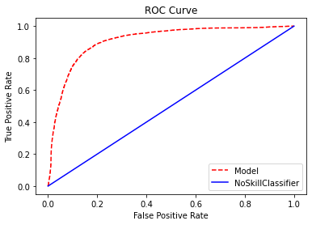
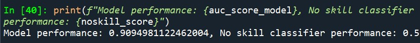
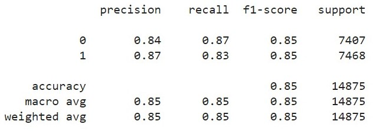
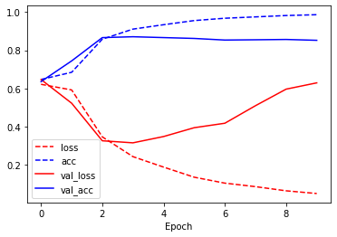
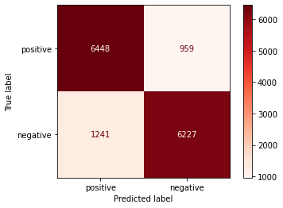
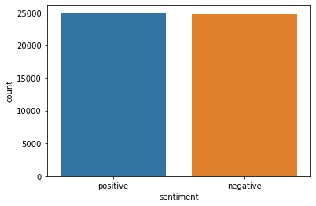

# Good or Bad Review? -A Sentiment Analysis-
Tens of thousands of movie reviews can be scrapped off the Internet in seconds, here is how you can categorise your fresh-off-the-Internet reviews quickly without breaking a sweat. This model is trained with 50,000 IMDB reviews to categorise positive/negative reviews using LSTM technique. Credits to [Ankit152](https://github.com/Ankit152) for the dataset which can be obtained [here](https://github.com/Ankit152/IMDB-sentiment-analysis).

## [UPDATE] ROC curve
ROC curve plot is added for better assessment of model performance:

Overview of model performance expressed under Area Under Curve (UAC) of ROC:

## Model Accuracy
The model achieved **85%** accuracy, utilizing **Adam** optimiser, **MSE** for loss function and **accuracy** for metrics. Performance of model is summarised below:

| Performance Plot | Confusion Matrix |
| ----------- | ----------- |
|  |  |

## Dataset Overview
Dataset has shape `(50000, 2)`, containing 50K reviews with labelled sentiment value `['positive' 'negative']`. Dataset is fairly balanced:

## Data Inspection/ Cleaning
Dataset contains `418` duplicated reviews hence removed. 
**HTML** tags, **numbers** are filtered from dataset using **RegEx** module and subsequently lower-cased and splitted using `.lower()` and `.split()`. 

## Preprocessing
### Tokenizer
**`Tokenizer()`** is used with hyperparameter **`num_words=10000`**.

### Padding
Length of each reviews are calculated and summarised with `length_of_review=[len(i) for i in train_sequences]` and **median value** obtained is `180`.
Parameters of padding is summarised below:

`padded_review=pad_sequences(train_sequences,maxlen=180,truncating='post',padding='post')`

### Encoding Target Feature
**One Hot Encoder** is used on target feature to expand columns for unique labelling.

### Train test split
**Train** and **test** dataset is splitted at 7:3 ratio.

## Model Architecture
**`Sequential()`** approach is applied in model building. Model contains **Embedding**, **Bidirectional(LSTM)**, and **LSTM** layers:

## Discussion
Model is able to achieve 98% and 85% during training and testing respectively, however model started to overfit at the 2nd epoch. 
Adjustments to be made to avoid model overfit:
- [ ] Increase dropout rate.
- [ ] Implement early stopping.

Improvements to consider to enhance accuracy:

- [ ] Apply stemming/ lemmatization in preprocessing step.
- [ ] Apply TF-IFD/ CNN technique in model development.
- [ ] Refer/ utilize other pretrained model.

