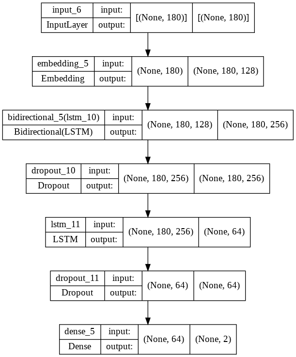

# SentimentAnalysis
 Trained over 60,000 IMDB dataset to categorise positive/negative reviews
### Step by step guide

**Hello World bolded**

## To insert code in Readme

`import numpy as np`

`print('hello world')`

This is fun! 😹

## To insert URL

[URL](https://www.markdownguide.org/cheat-sheet/)

## To include images

